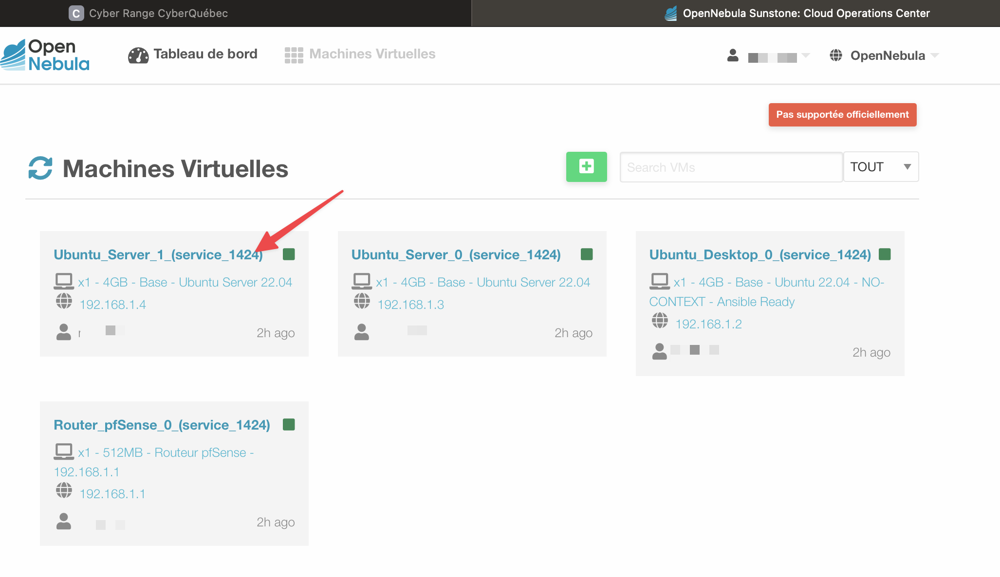

# Utilisation de CyberQuébec

Voici les informations pour l'utilisation de l'environnement de CyberQuébec.

## Connexion au VPN
Pour vous connecter au VPN, naviguez à l'adresse [https://vpn.cyberquebec.org](https://vpn.cyberquebec.org) et entrez avec votre compte.

## Connexion au CyberRange
Une fois connectée au VPN, cliquez sur **OpenNebula** et utilisez les mêmes identifiants pour rejoindre le CyberRange.

## Connexion aux machines virtuelles avec OpenNebula  
Une fois connectée, vous arrivez à votre tableau de bord. Pour accéder à vos VMs, cliquez sur le carré du groupe.


Cliquez sur la VM que vous voulez accéder.  




Pour vous connecter sur une machine, cliquez sur l'icône d'écran vis-à-vis la machine souhaitée et choisissez VNC. 
 


Les identifiants des machines virtuelles sont :  
- Nom d'utilisateur: env-admin  
- Mot de passe: admin-env

Les VMs ont des adresses dynamiques. Vous pouvez renouveler une adresse dans le réseau avec la commande suivante ou passer par Network Manager :

```bash
sudo dhclient -v ens3
```

Cette commande fonctionne pour toute VM Linux, vous devez remplacer le nom de l'interface par celui de votre Linux. Pour trouver le nom de l'interface :

```bash
ip link
```


### Instantanés (snapshot)

Pour créer un instantané, cliquer sur **Instantanés**, puis sur **Prendre un instantané**.  
  

Pour revenir à un instantané, cliquer sur **Revenir**.  
  
